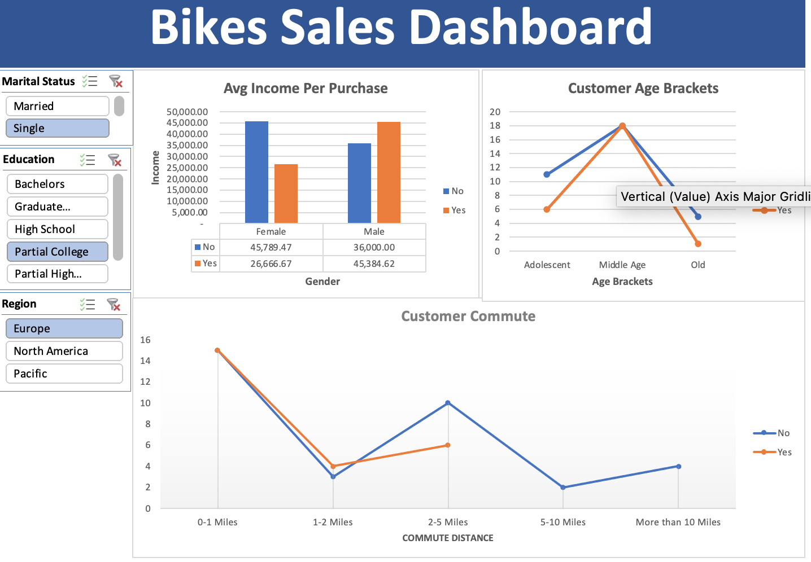

#  Bike Buyers Analysis — Excel Dashboard Project

A data analysis project built in Microsoft Excel, exploring customer demographics to understand what factors influence bike purchases.

> Built following the [Alex The Analyst](https://www.youtube.com/@AlexTheAnalyst) Excel Bootcamp series.

---

## Project Overview

This project analyses a bike buyers dataset to uncover patterns across demographics such as income, age, commute distance, occupation, and region. The goal was to answer:

> **What kind of customer is most likely to purchase a bike?**

---

## Dataset

| Field | Details |
|---|---|
| **Records** | 1,026 customers |
| **Columns** | 13 (ID, Marital Status, Gender, Income, Children, Education, Occupation, Home Owner, Cars, Commute Distance, Region, Age, Purchased Bike) |
| **Regions** | North America, Europe, Pacific |

---

## Tools Used

- **Microsoft Excel**

---

##  Workbook Structure

| Sheet | Description |
|---|---|
| **bike_buyers** | Raw dataset with all 1,026 records |
| **Working Sheet** | Cleaned data with standardised values (e.g. M/F → Male/Female, M/S → Married/Single) and a new **Age Brackets** column |
| **Pivot Table** | Pivot tables summarising purchase rates by gender, commute distance, and age bracket |
| **Dashboard** | Interactive dashboard with slicers for filtering by Marital Status, Region, and Education |

---

##  Process

### 1. Data Cleaning
- Removed duplicate rows
- Standardised abbreviations (M/F → Married/Single, M/F → Male/Female)
- Added an **Age Brackets** column to group customers into: Adolescent, Middle Age, Old

### 2. Pivot Tables
Built pivot tables to compare bike purchases across:
- **Average income** by gender
- **Commute distance** (0-1 Miles through 10+ Miles)
- **Age bracket**

### 3. Dashboard
Assembled an interactive dashboard with slicers for filtering the charts dynamically

---

##  Key Findings

- **Middle-aged customers (31–54)** are the most likely to purchase a bike
- **Short-distance commuters (0–1 miles)** make up the largest buyer group
- **Higher-income males** are more likely to purchase than lower-income males
- **Lower-income females** purchase at a higher rate than higher-income females

---

##  Dashboard Preview

> 

---

## How to Use

1. Download the `.xlsx` file from this repository
2. Open in Microsoft Excel (2016 or later recommended)
3. Navigate to the **Dashboard** sheet
4. Use the **slicers** to filter by Marital Status, Region, and Education

---

## Author

**James Halam**
- LinkedIn: [(https://www.linkedin.com/in/jameshalam/)]
- GitHub: [(https://github.com/Jamesranglong)]

---

##  Acknowledgements

Project inspired by [Alex The Analyst](https://www.youtube.com/@AlexTheAnalyst) — Excel Bootcamp series.
